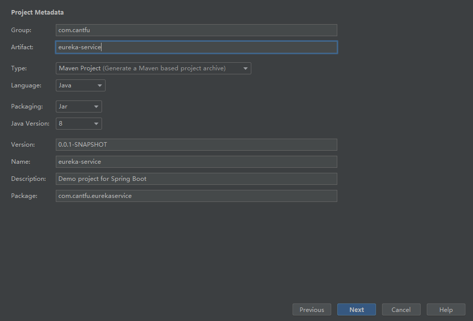
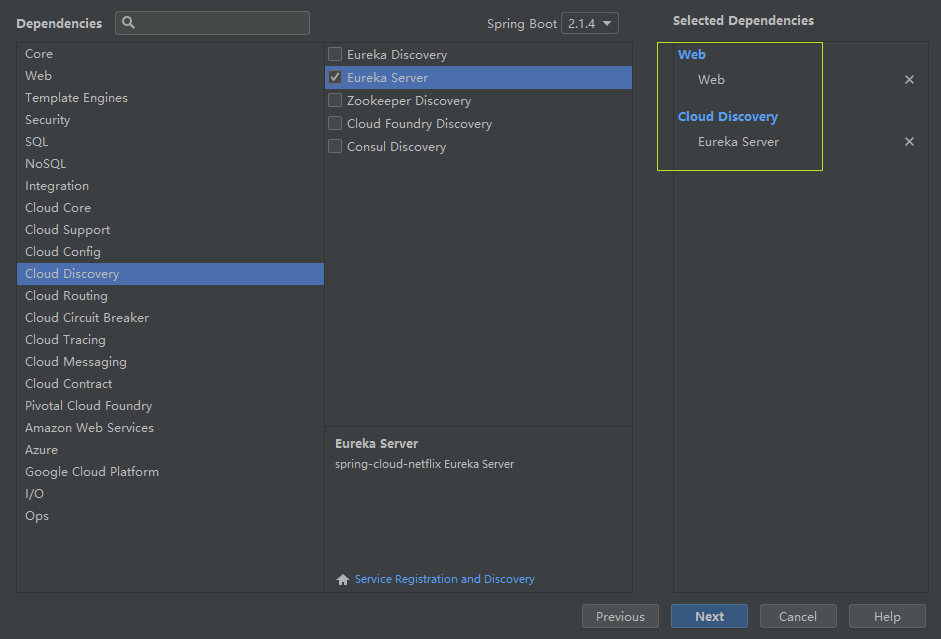
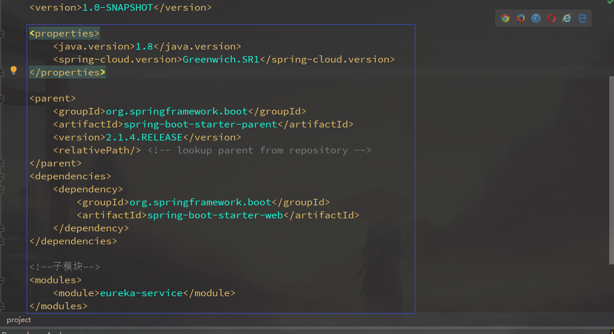
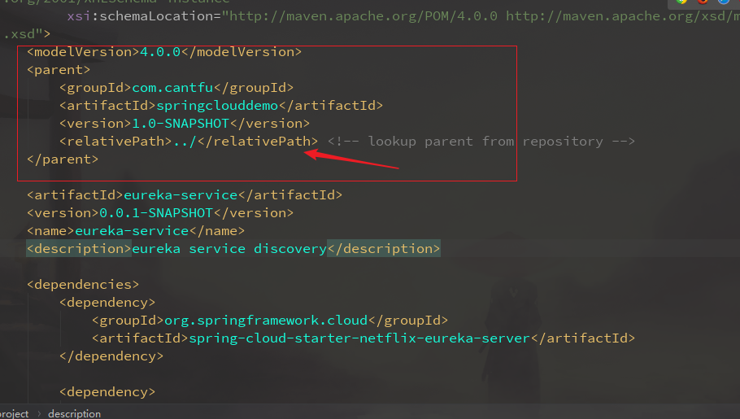
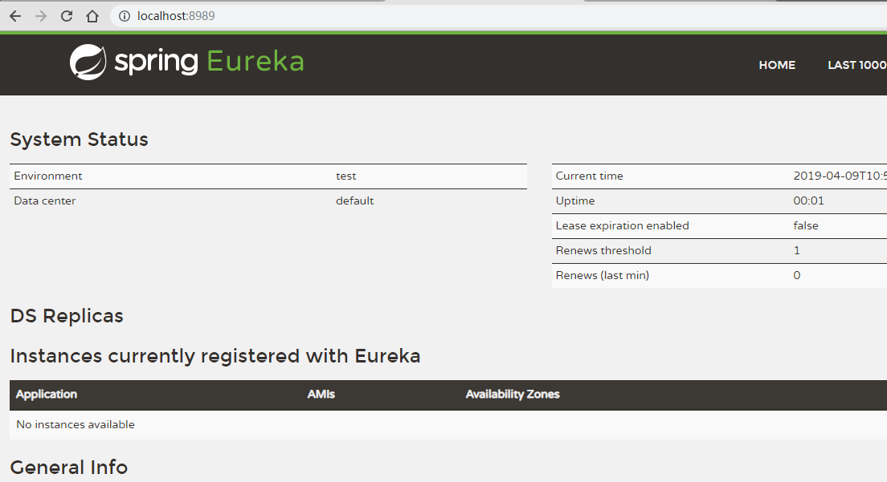
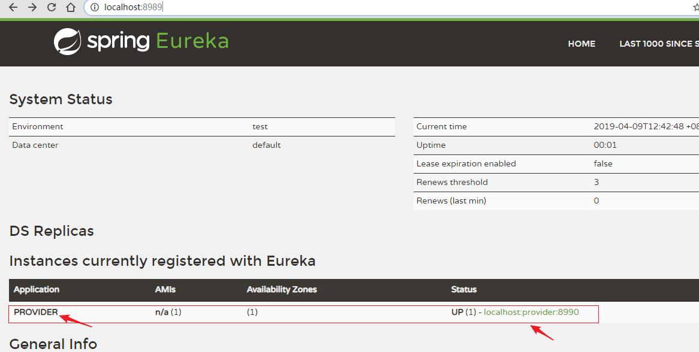
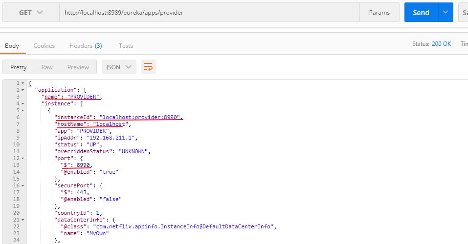
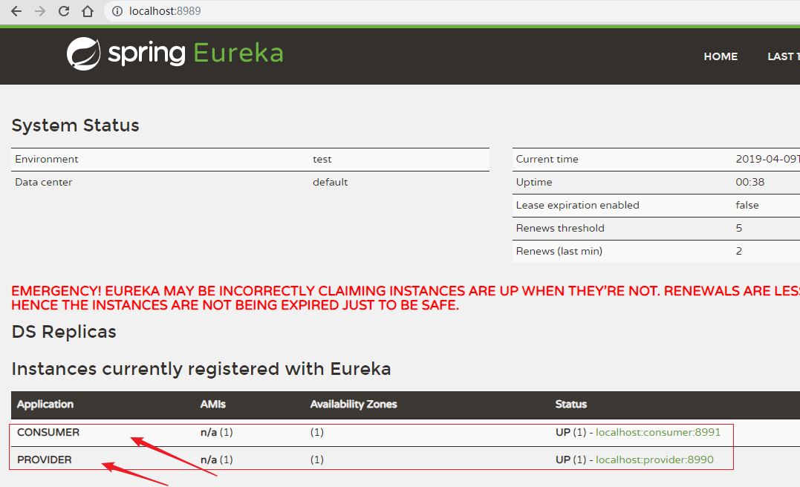
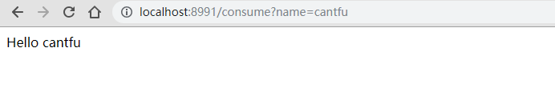
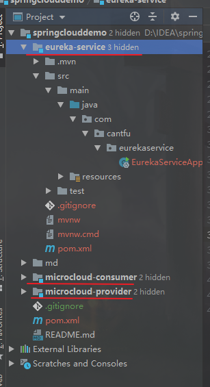

## Spring Cloud 组件之 Eureka

> JDK 8
>
> Spring Boot：2.1.4
>
> Spring Cloud ：Greenwich.SR1

[Github：https://github.com/cantfu/springclouddemo](<https://github.com/cantfu/springclouddemo>)

### 声明

该篇只是用于的Eureka 的 demo，不涉及理论知识，请先了解其基本理论。

### 1.建立父容器

新建一个 Maven 项目，作为父容器，不用运行服务，不需要 src/文件夹。

### 2.建立服务中心 Eureka

在此项目上右击 New - Module - Spring Initializr



选上 Web 和 Eureka Server 组件.



#### 2.1 添加依赖

在父容器的 pom 中添加 boot、属性、web模块、子模块（从eureka-service的pom中复制）



删除子容器eureka-service中的 pom 中的web模块、属性，并继承父容器 springclouddemo，如下



#### 2.2 注册服务中心

在 EurekaServiceApplication 类上添加注解 @EnableEurekaServer。

```java
package com.cantfu.eurekaservice;

import org.springframework.boot.SpringApplication;
import org.springframework.boot.autoconfigure.SpringBootApplication;
import org.springframework.cloud.netflix.eureka.server.EnableEurekaServer;

@SpringBootApplication
@EnableEurekaServer
public class EurekaServiceApplication {

    public static void main(String[] args) {
        SpringApplication.run(EurekaServiceApplication.class, args);
    }

}
```

@EnableEurekaServer ,Eureka Server 会将自己也看作是一个 client，需要在配置文件中进行相应配置。

application.peoperties

```properties
#服务注册中心端口号
server.port=8989
#服务注册中心实例的主机名
eureka.instance.hostname=localhost
#是否向服务注册中心注册自己
eureka.client.register-with-eureka=false
#是否同步服务列表到本地
eureka.client.fetch-registry=false
#服务注册中心的配置内容，指定服务注册中心的位置
eureka.client.service-url.defaultZone=http://${eureka.instance.hostname}:${server.port}/eureka/

```

eureka.client.register-with-eureka=false、eureka.client.fetch-registry=false 就可以表明这是一个 Server 而不是Client。

此时启动 eurka-service 子项目，访问<http://localhost:8989/>即可看到成功界面。



### 3.建立服务提供者（microcloud-provider）

服务提供者也是一个 eureka 的客户端，需要去注册到 eureka sever中。会提供一些元数据，例如主机和端口，URL，主页等。Eureka server 从每个client实例接收心跳消息。 如果心跳超时，则通常将该实例从注册server中删除。

新建 boot 模块 microcloud-provider，和前面一样，只是依赖变成需要 Eureka Discovery 了。

新建后修改 microcloud-provider 的 pom 文件，改变父依赖。如下：

```xml
<?xml version="1.0" encoding="UTF-8"?>
<project xmlns="http://maven.apache.org/POM/4.0.0" xmlns:xsi="http://www.w3.org/2001/XMLSchema-instance"
         xsi:schemaLocation="http://maven.apache.org/POM/4.0.0 http://maven.apache.org/xsd/maven-4.0.0.xsd">
    <modelVersion>4.0.0</modelVersion>
    <parent>
        <groupId>com.cantfu</groupId>
        <artifactId>springclouddemo</artifactId>
        <version>1.0-SNAPSHOT</version>
        <relativePath>../</relativePath> <!-- lookup parent from repository -->
    </parent>

    <artifactId>microcloud-provider</artifactId>
    <version>0.0.1-SNAPSHOT</version>
    <name>microcloud-provider</name>
    <description>microcloud provider,Eureka Client</description>

    <dependencies>
        <dependency>
            <groupId>org.springframework.cloud</groupId>
            <artifactId>spring-cloud-starter-netflix-eureka-client</artifactId>
        </dependency>

        <dependency>
            <groupId>org.springframework.boot</groupId>
            <artifactId>spring-boot-starter-test</artifactId>
            <scope>test</scope>
        </dependency>
    </dependencies>

    <dependencyManagement>
        <dependencies>
            <dependency>
                <groupId>org.springframework.cloud</groupId>
                <artifactId>spring-cloud-dependencies</artifactId>
                <version>${spring-cloud.version}</version>
                <type>pom</type>
                <scope>import</scope>
            </dependency>
        </dependencies>
    </dependencyManagement>

    <build>
        <plugins>
            <plugin>
                <groupId>org.springframework.boot</groupId>
                <artifactId>spring-boot-maven-plugin</artifactId>
            </plugin>
        </plugins>
    </build>

</project>

```

使用@EnableEurekaClient 注解，表示是一个 Eureka Client。

```java
package com.cantfu.microcloudprovider;

import org.springframework.boot.SpringApplication;
import org.springframework.boot.autoconfigure.SpringBootApplication;
import org.springframework.cloud.netflix.eureka.EnableEurekaClient;

@SpringBootApplication
@EnableEurekaClient
public class MicrocloudProviderApplication {

    public static void main(String[] args) {
        SpringApplication.run(MicrocloudProviderApplication.class, args);
    }

}

```

再在配置中配置服务注册中心的地址等。

```properties
server.port=8990

#此微服务的应用名,可多个重名，表示提供同样的服务--集群
spring.application.name=provider

#服务注册中心实例的主机名和地址
eureka.instance.hostname=localhost
eureka.port=8989
eureka.client.service-url.defaultZone=http://${eureka.instance.hostname}:${eureka.port}/eureka/

#注册到 sever 并需要同步服务列表
eureka.client.register-with-eureka=true
eureka.client.fetch-registry=true
```

编写一个 Controller 用于提供服务。

```java
package com.cantfu.microcloudprovider.controller;

import org.springframework.web.bind.annotation.PathVariable;
import org.springframework.web.bind.annotation.RequestMapping;
import org.springframework.web.bind.annotation.RestController;

@RestController
public class HelloController {

    @RequestMapping(value = "/hello/{name}")
    public String hello(@PathVariable("name") String name){
        return "Hello "+name;
    }
}

```


若此时先启动 eureka-service 再启动 microcloud-provider，访问 http://localhost:8989/，可看到 provider已经注册到 eureka sever上去了。



erueka sever 也提供了相应服务详细信息，可通过url 访问，http://localhost:8989/eureka/apps/provider

可以看到 provider 服务的详细信息。（可以设置Accept为application/json）。



### 4.建立服务消费者(microcloud-consumer)

和服务提供者一样，建立spring boot 模块，添加 Eureka Discovery 依赖，修改pom文件和配置文件，配置文件注意 改服务端口号和实例名 不同就行。

```properties
server.port=8991

#此微服务的应用名
spring.application.name=consumer

#服务注册中心实例的主机名和地址
eureka.instance.hostname=localhost
eureka.port=8989
eureka.client.service-url.defaultZone=http://${eureka.instance.hostname}:${eureka.port}/eureka/

#注册到 sever 并需要同步服务列表
eureka.client.register-with-eureka=true
eureka.client.fetch-registry=true
```

启动类加上@EnableEurekaClient 注解，即为向 服务中心注册服务。

编写 Controller 用于消费 provider中的服务。

```java
package com.cantfu.microcloudconsumer.controller;

import org.springframework.beans.factory.annotation.Autowired;
import org.springframework.boot.web.client.RestTemplateBuilder;
import org.springframework.cloud.client.ServiceInstance;
import org.springframework.cloud.client.discovery.DiscoveryClient;
import org.springframework.web.bind.annotation.RequestMapping;
import org.springframework.web.bind.annotation.RestController;
import org.springframework.web.client.RestTemplate;

import java.util.List;

@RestController
public class ConsumeController {
    @Autowired
    RestTemplateBuilder restTemplateBuilder;

    @Autowired
    DiscoveryClient discoveryClient;

    @RequestMapping("/consume")
    public String consume(String name){
        RestTemplate restTemplate = restTemplateBuilder.build();

        // 根据服务名获取 服务集群
        List<ServiceInstance> instances = discoveryClient.getInstances("provider");
        ServiceInstance serviceInstance = instances.get(0);

        String host = serviceInstance.getHost();
        int port = serviceInstance.getPort();
        String url = "http://" + host + ":" + port + "/hello/" + name;
        return restTemplate.getForObject(url, String.class);

    }
}

```


此时运行 Consumer 服务，访问 http://localhsot:8989/,可以看到两个服务都已注册



访问 http://localhost:8991/consume?name=cantfu,来调用服务。如下图，可以看到调用成功。



至此，Eureka 的服务注册和发现 已经完成。注意：以上都是单节点的配置。配置多节点实现高可用，才是一般的配置。

另外：项目目录为：springclouddemo下有三个module，



[Github：https://github.com/cantfu/springclouddemo](<https://github.com/cantfu/springclouddemo>)