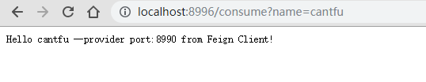
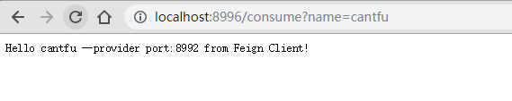
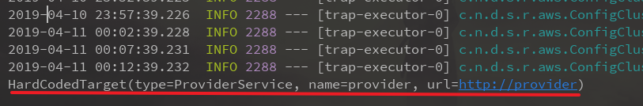

## Spring Cloud 组件之 Feign

> JDK 8
>
> Spring Boot：2.1.4
>
> Spring Cloud ：Greenwich.SR1

官方链接：<http://cloud.spring.io/spring-cloud-netflix/single/spring-cloud-netflix.html#spring-cloud-ribbon>

[Github：https://github.com/cantfu/springclouddemo](<https://github.com/cantfu/springclouddemo>)

### 声明

该篇Feign 的 demo，不太涉及理论知识，请先了解其基本理论。Feign 只是简化了服务调用的编码，使得服务调用不用去拼接 url 字符了，只需要像方法一样调用即可。

### 1.新建模块 

新建模块 microcloud-consumer-feign，需要添加依赖 `spring-cloud-starter-netflix-eureka-client`、`spring-cloud-starter-openfeign`.

```xml
<dependency>
    <groupId>org.springframework.cloud</groupId>
    <artifactId>spring-cloud-starter-netflix-eureka-client</artifactId>
</dependency>
<dependency>
    <groupId>org.springframework.cloud</groupId>
    <artifactId>spring-cloud-starter-openfeign</artifactId>
</dependency>
```

更改其 pom.xml 文件使得继承父容器 springclouddemo 的依赖，同以前的例子。

### 2.修改配置文件

和以往一样，加入 Eureka 服务的配置即可。

application.properties:

```properties
server.port=8996

#此微服务的应用名
spring.application.name=consumer

#服务注册中心实例的主机名和地址
eureka.instance.hostname=localhost
eureka.port=8989
eureka.client.service-url.defaultZone=http://${eureka.instance.hostname}:${eureka.port}/eureka/

#注册到 sever 并需要同步服务列表
eureka.client.register-with-eureka=true
eureka.client.fetch-registry=true
```

### 3.开启 Feign 功能

在启动类上添加 `@EnaleFeignable` 和 `@EnableEurekaClient`注解，使得开启 Feign 功能和注册此服务功能。

```java
package com.cantfu.microcloudconsumerfeign;

import org.springframework.boot.SpringApplication;
import org.springframework.boot.autoconfigure.SpringBootApplication;
import org.springframework.cloud.netflix.eureka.EnableEurekaClient;
import org.springframework.cloud.openfeign.EnableFeignClients;

@SpringBootApplication
@EnableEurekaClient
@EnableFeignClients
public class MicrocloudConsumerFeignApplication {

    public static void main(String[] args) {
        SpringApplication.run(MicrocloudConsumerFeignApplication.class, args);
    }

}
```

### 4.创建一个 Feign 接口

编写 ProviderService 接口，对应着 Provider 服务，抽象方法写 Provider 服务的API，要一致。

```java
package com.cantfu.microcloudconsumerfeign;

import org.springframework.cloud.openfeign.FeignClient;
import org.springframework.web.bind.annotation.PathVariable;
import org.springframework.web.bind.annotation.RequestMapping;

@FeignClient(name="provider")
public interface ProviderService {
// @FeignClient 的name指向对应的服务名,没有用服务发现功能（Eureka）的话需要指定 url

    /** 调用 provider 服务的 hello接口，必须和 provider 中一致*/
    @RequestMapping(value = "/hello/{name}")
    String hello(@PathVariable("name") String name);
}
```

这样一来，在需要调用 Provider 服务时，注入 ProviderService 一个实例即可，这个实例由 Feign 帮我们生成，如同以往的 Dao 接口，Mybatis 自动生成实例，我们只需调用即可。

### 5.更改 provider 的接口

这个非必须的，只是为了展示一下调用的接口，方便看出负载均衡 了而已。如下，返回结果中包含了端口信息。

```java
package com.cantfu.microcloudprovider.controller;

import org.springframework.beans.factory.annotation.Value;
import org.springframework.web.bind.annotation.PathVariable;
import org.springframework.web.bind.annotation.RequestMapping;
import org.springframework.web.bind.annotation.RestController;

@RestController
public class HelloController {
    @Value("${server.port}")
    int port = 0;

    @RequestMapping(value = "/hello/{name}")
    public String hello(@PathVariable("name") String name){
        return "Hello "+name+" --provider port:"+port;
    }
}
```

### 6.编写 feign 客户端访问接口

就是此服务（comsumer-feign）的访问接口。

只需注入 	`ProviderService` ,通过 feign 接口类（ProviderService）访问即可。

```java
package com.cantfu.microcloudconsumerfeign.controller;

import com.cantfu.microcloudconsumerfeign.ProviderService;
import feign.Target;
import org.springframework.beans.factory.annotation.Autowired;
import org.springframework.web.bind.annotation.RequestMapping;
import org.springframework.web.bind.annotation.RequestParam;
import org.springframework.web.bind.annotation.RestController;

@RestController
public class ConsumerController {

    @Autowired
    ProviderService providerService;

    @RequestMapping(value = "/consume")
    public String consume(@RequestParam("name") String name){
        System.out.println(providerService);
        return providerService.hello("cantfu") + " from Feign Client!";
    }
}
```

### 7.测试

+ 开启 eureka

+ 依次开启 两个provider、开启 consumer-feign

  可访问 http://localhost:8989/ 查看是否注册成功。

+ 多次访问 <http://localhost:8996/consume?name=cantfu> 可看到从不同 povider 返回的结果，说明实现了服务调用以及负载均衡。





在控制台也打印了 注入的 ProviderService 的信息。



### 8.总结

在 访问 feign 消费者api时，通过注入的 ProviderService 知道了要调用的服务名是 provider，再通过 Ribbon 从本地服务列表找到了 provider的集群（所有provider实例），再通过本地均衡负载算法找出了一个具体的服务实例（provider），从而具体地调用了服务，获取了服务的信息。

Feign 是用来**通过方法调用服务**的，它在Eureka、Ribbon的服务之上，它的运行需要（当然亦可以不需要，不过就要自己配置了）Ribbon 的**将实例名（如 provider）转化为 url（localhost:8990）** 的功能和**负载均衡**功能，而 Ribbon 的将实例名转化为 url 与 负载均衡是需要 Eureka 的服务发现功能的（当然也可以不需要，自己手动指定服务列表，但这样就不利于改动，不符合我们预期，服务治理是微服务不可或缺的功能）。

之前的 Ribbon + RestTemplate 只是可以将 url 中的ip和port 由 服务名 所代替，但还是要拼接字符串，不方便。


[Github：https://github.com/cantfu/springclouddemo](<https://github.com/cantfu/springclouddemo>)