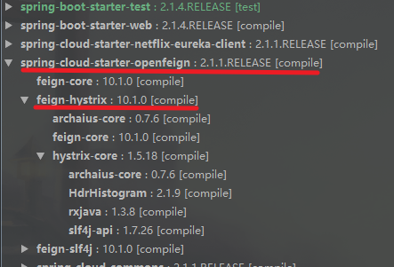
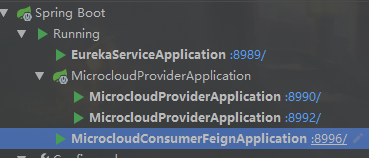
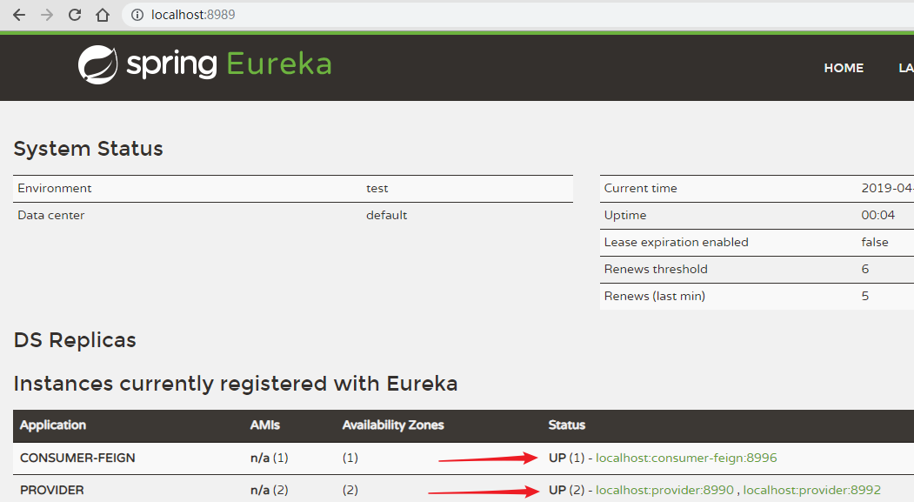
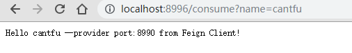
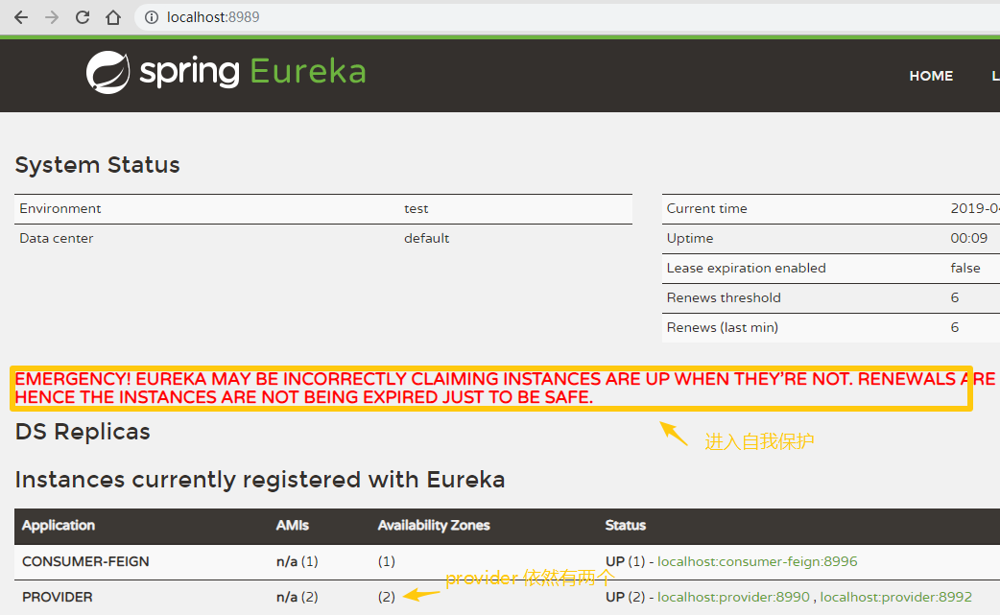
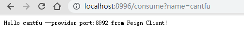
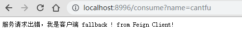

## Spring Cloud 组件之 Feign

> JDK 8
>
> Spring Boot：2.1.4
>
> Spring Cloud ：Greenwich.SR1

官方链接：

<https://github.com/Netflix/Hystrix/>

<https://cloud.spring.io/spring-cloud-static/spring-cloud-netflix/2.1.0.RELEASE/single/spring-cloud-netflix.html#_circuit_breaker_hystrix_clients>

demo: <https://github.com/cantfu/springclouddemo>

### 0.声明

该篇是断路器 Hystrix 的 demo，不太涉及理论知识，请先了解其基本理论。此篇在 上篇 [Feign](https://github.com/cantfu/springclouddemo/blob/master/md/SpringCloud%E7%BB%84%E4%BB%B6%E4%B9%8BFeign.md) 的基础上进行。

### 1.明确 Hystrix 依赖



可以看到 openfeign 中已经包含了 Hystrix 的依赖，不用添加任何其他依赖了。所以此篇在上篇的demo上直接进行改造。

若用 Ribbon+RestTemplate 的方式就要再引入 spring-cloud-starter-netflix-hystrix 依赖。

### 2.实现 Hystrix 功能

1. 开启熔断器

   在feign-server服务配置文件加上feign.hystrix.enabled=true用来开启熔断器

   ```properties
   server.port=8996
   
   #此微服务的应用名
   spring.application.name=consumer-feign
   
   #服务注册中心实例的主机名和地址
   eureka.instance.hostname=localhost
   eureka.port=8989
   eureka.client.service-url.defaultZone=http://${eureka.instance.hostname}:${eureka.port}/eureka/
   
   #注册到 sever 并需要同步服务列表
   eureka.client.register-with-eureka=true
   eureka.client.fetch-registry=true
   
   #开启熔断器
   feign.hystrix.enabled=true
   ```

2. 在注解 @FeignClient 上加上 fallback 并指向异常回调类

   之前的 @FeignClient 没有fallback 属性. @FeignClient(name="provider")

   + 添加之前 ProviderService 的实现类，用作 fallback，并注入 spring

     ```java
     package com.cantfu.microcloudconsumerfeign;
     import org.springframework.stereotype.Component;
     /**
      * ProviderService 的 fallback 处理
      */
     @Component
     public class ProviderServiceFallBackImpl implements ProviderService {
         @Override
         public String hello(String name) {
             return "服务请求出错，我是客户端 fallback !";
         }
     }
     ```

   + 添加 @FeignClient 的 fallback 属性。

     ```java
     package com.cantfu.microcloudconsumerfeign;
     import org.springframework.cloud.openfeign.FeignClient;
     import org.springframework.web.bind.annotation.PathVariable;
     import org.springframework.web.bind.annotation.RequestMapping;
     /**
      * provider 服务的调用,加上了熔断处理
      */
     @FeignClient(name="provider",fallback = ProviderServiceFallBackImpl.class)
     public interface ProviderService {
     // @FeignClient 的name指向对应的服务名,没有用服务发现功能（Eureka）的话需要指定 url
     
         /** 调用 provider 服务的 hello接口，必须和 provider 中一致*/
         @RequestMapping(value = "/hello/{name}")
         String hello(@PathVariable("name") String name);
     }
     ```

### 3.测试

+ 依次开启 Eureka-server、两个 provider 以及 microcloud-consumer-feign，如下所示

  

  访问 <http://localhost:8989/> 可以看到服务都已注册成功。

  

+ 访问 <http://localhost:8996/consume?name=cantfu> 可见服务调用成功。

  

+ 关闭一个 provider 服务(如8990端口的)，再次访问 eureka server，发现 provider 还是两个，这是eureka 进入了自我保护，不会删除服务列表。

  

  v这样的话已下线的8990端口的 provider 不会被剔除，负载均衡时仍然会考虑它，从而发生错误就调用了 fallback，但我们不想这样，我们希望所有集群不可用时才调用 fallback ，可以通过 eureka.server.enable-self-preservation来 true打开/false 禁用自我保护机制。

+ 禁用自我保护之后，此时访问 <http://localhost:8996/consume?name=cantfu>

  

  成功访问 另一生产者节点。

+ 关闭 8992 这一 provider 服务，此时集群都不可用。访问：<http://localhost:8996/consume?name=cantfu>

  

  可以看出成功实现了熔断，调用了 fallback.

+ 在网络超时（默认1000ms）时，也会调用 fallback ，可自行尝试。


[Github：https://github.com/cantfu/springclouddemo](<https://github.com/cantfu/springclouddemo>)