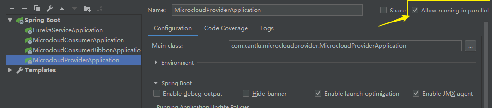
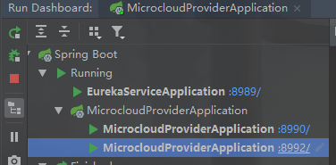
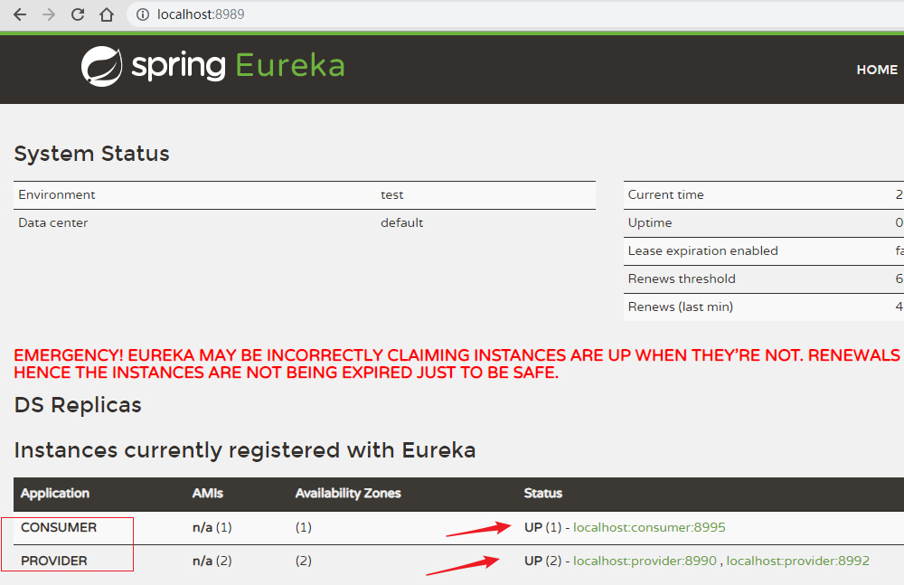
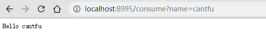
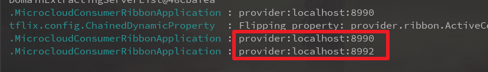
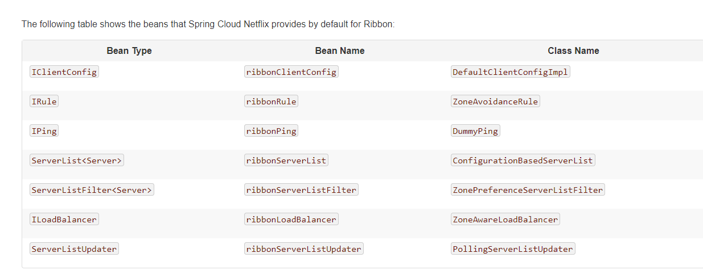

## Spring Cloud 组件之 Ribbon

> JDK 8
>
> Spring Boot：2.1.4
>
> Spring Cloud ：Greenwich.SR1

官方链接：<http://cloud.spring.io/spring-cloud-netflix/single/spring-cloud-netflix.html#spring-cloud-ribbon>

[Github：https://github.com/cantfu/springclouddemo](<https://github.com/cantfu/springclouddemo>)

### 声明

该篇只是用于的 Eureka 和 Ribbon 整合的 demo，不太涉及理论知识，请先了解其基本理论。

### 1 建立含有 Ribbon 的消费者

#### **1.1 新建模块 microcloud-comsumer-ribbon**

Spring Cloud Ribbon 依赖 spring-cloud-starter-netflix-ribbon 模块，但是 spring-cloud-starter-netflix-eureka-client 模块中已经有 spring-cloud-starter-netflix-ribbon 模块了，因此只需引入 spring-cloud-starter-netflix-eureka-client 模块（毕竟还是需要 Eureka 客户端的）。那么建立步骤和 microcloud-consumer 的步骤完全一样。

**pom.xml** 文件如下：

``` xml
<?xml version="1.0" encoding="UTF-8"?>
<project xmlns="http://maven.apache.org/POM/4.0.0" xmlns:xsi="http://www.w3.org/2001/XMLSchema-instance"
         xsi:schemaLocation="http://maven.apache.org/POM/4.0.0 http://maven.apache.org/xsd/maven-4.0.0.xsd">
    <modelVersion>4.0.0</modelVersion>
    
    <!--更改父依赖-->
    <parent>
        <groupId>com.cantfu</groupId>
        <artifactId>springclouddemo</artifactId>
        <version>1.0-SNAPSHOT</version>
        <relativePath>../</relativePath>
    </parent>
    
    <artifactId>microcloud-consumer-ribbon</artifactId>
    <version>0.0.1-SNAPSHOT</version>
    <name>microcloud-consumer-ribbon</name>
    <description>Ribbon used to LB</description>

    <properties>
        <java.version>1.8</java.version>
        <spring-cloud.version>Greenwich.SR1</spring-cloud.version>
    </properties>
    
	<!-- eureka 和 Ribbon 的依赖-->
    <dependencies>
        <dependency>
            <groupId>org.springframework.cloud</groupId>
            <artifactId>spring-cloud-starter-netflix-eureka-client</artifactId>
        </dependency>

        <dependency>
            <groupId>org.springframework.boot</groupId>
            <artifactId>spring-boot-starter-test</artifactId>
            <scope>test</scope>
        </dependency>
    </dependencies>

    <dependencyManagement>
        <dependencies>
            <dependency>
                <groupId>org.springframework.cloud</groupId>
                <artifactId>spring-cloud-dependencies</artifactId>
                <version>${spring-cloud.version}</version>
                <type>pom</type>
                <scope>import</scope>
            </dependency>
        </dependencies>
    </dependencyManagement>

    <build>
        <plugins>
            <plugin>
                <groupId>org.springframework.boot</groupId>
                <artifactId>spring-boot-maven-plugin</artifactId>
            </plugin>
        </plugins>
    </build>

</project>
```

#### **1.2 修改配置文件** 

application.properties

```properties
server.port=8995

#此微服务的应用名
spring.application.name=consumer

#服务注册中心实例的主机名和地址
eureka.instance.hostname=localhost
eureka.port=8989
eureka.client.service-url.defaultZone=http://${eureka.instance.hostname}:${eureka.port}/eureka/

#注册到 sever 并需要同步服务列表
eureka.client.register-with-eureka=true
eureka.client.fetch-registry=true
```

#### 1.3 **改写 启动类**

+ 增加注解 @EnableEurekaClient 向服务注册中心注册自己
+ 增加 RestTemplate bean,并注入
+ 在 restTemplate 上加上 @LoadBalanced，让restTemplate 有均衡负载功能。
+ 注入 loadBalancerClient,可以返回一个服务集群中的一个实例
+ 编写 comsume 接口，调用provider服务

```java
package com.cantfu.microcloudconsumerribbon;

import org.slf4j.Logger;
import org.slf4j.LoggerFactory;
import org.springframework.beans.factory.annotation.Autowired;
import org.springframework.boot.SpringApplication;
import org.springframework.boot.autoconfigure.SpringBootApplication;
import org.springframework.cloud.client.ServiceInstance;
import org.springframework.cloud.client.loadbalancer.LoadBalanced;
import org.springframework.cloud.client.loadbalancer.LoadBalancerClient;
import org.springframework.cloud.netflix.eureka.EnableEurekaClient;
import org.springframework.context.annotation.Bean;
import org.springframework.web.bind.annotation.RequestMapping;
import org.springframework.web.bind.annotation.RestController;
import org.springframework.web.client.RestTemplate;

@SpringBootApplication
@EnableEurekaClient
@RestController
public class MicrocloudConsumerRibbonApplication {

    private static final Logger LOGGER = LoggerFactory.getLogger(MicrocloudConsumerRibbonApplication.class);

    @Bean(value = "restTemplate")
    @LoadBalanced
    public RestTemplate restTemplate(){
        return new RestTemplate();
    }

    @Autowired
    RestTemplate restTemplate;

    @Autowired
    LoadBalancerClient loadBalancerClient;

    @RequestMapping("/consume")
    public String comsume(String name){
        // 负载均衡选择一个实例
        ServiceInstance provider = loadBalancerClient.choose("provider");
        LOGGER.info("{}:{}:{}",provider.getServiceId(),provider.getHost(),provider.getPort());

        return restTemplate.getForObject("http://provider/hello/"+name, String.class);

    }

    public static void main(String[] args) {
        SpringApplication.run(MicrocloudConsumerRibbonApplication.class, args);
    }

}
```

可以看到，上面 restTemplate 调用 provider 服务时没有手动获取 provider 集群，没有写出固定的 ip 、 port，只是使用 provider 代替，因为 加了 @LoadBalanced 注解，restTemplate 调用服务时，Ribbon 会自动调用负载均衡算法找出一个provider 的实例，并进行访问。

### 2 负载均衡测试

+ 启动 eureka-service 模块，端口为 8989

+ 启动 microcloud-provider 模块

  启动前修改 provider 的设置，

  

  启动 microcloud-provider ，端口为8990

  修改 microcloud-provider 的端口为 8992，启动，此时启动了两个 microcloud-provider ，服务名都为 provider。

  

+ 启动 microcloud-consumer-ribbon 模块，端口号为 8995

+ 访问 即可 <http://localhost:8989/> 看到，两个 provider 和一个 consumer 都已注册

  

+ 访问 <http://localhost:8995/consume?name=cantfu>

  

+ 再次访问http://localhost:8995/consume?name=cantfu

  看 控制台的日志信息可以看出(没效果多访问几次)

  

  即可看到成功实现了 Ribbon的客户端负载均衡。


### 3 自定义 Ribbon配置

在[官方链接]( http://cloud.spring.io/spring-cloud-netflix/single/spring-cloud-netflix.html#spring-cloud-ribbon) 中可以看到，Spring Cloud Ribbon 为我们注入了以下的默认 bean。



我们若要配置则可以以 Java 配置、属性文件配置两种方式进行自定义，（覆盖上面那几个bean）

详细配置请直接看官方链接。

Java配置就用 @RibbonClients 和 @Configuration ，详情请看官链6.3

属性配置格式为 <clientName>.ribbon.*: \*,如 provider.ribbon.NFLoadBalancerRuleClassName:com.netflix.loadbalancer.RandomRule。详情见官链 6.4

[Github：https://github.com/cantfu/springclouddemo](<https://github.com/cantfu/springclouddemo>)