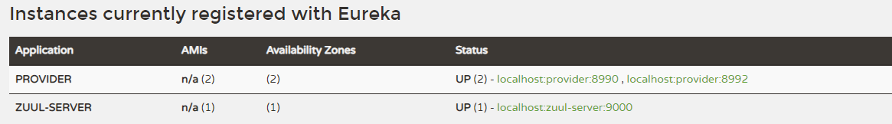
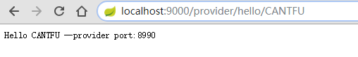
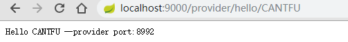
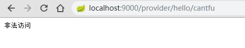
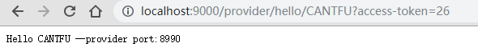

## Spring Cloud 组件之 Zuul

> JDK 8
>
> Spring Boot：2.1.4
>
> Spring Cloud ：Greenwich.SR1

[Github：https://github.com/cantfu/springclouddemo](<https://github.com/cantfu/springclouddemo>)

### 0.声明

该篇只是用于服务网关 Zuul 以及自定义过滤器的 demo，不太涉及理论知识，请先了解其基本理论。

### 1.建立 zuul-server 模块

建立的模块含有 zuul 和 eureka-client 依赖，再和以前一样继承 springclouddemo 父类就行。

```xml
<dependency>
    <groupId>org.springframework.cloud</groupId>
    <artifactId>spring-cloud-starter-netflix-eureka-client</artifactId>
</dependency>
<dependency>
    <groupId>org.springframework.cloud</groupId>
    <artifactId>spring-cloud-starter-netflix-zuul</artifactId>
</dependency>
```

### 2.开启 zuul

在启动类上添加 @EnableZuulProxy 开启网关功能，添加 @EnableEurekaClient 开启 服务注册功能。

```  java
package com.cantfu.microcloudprovider;

import org.springframework.boot.SpringApplication;
import org.springframework.boot.autoconfigure.SpringBootApplication;
import org.springframework.cloud.netflix.eureka.EnableEurekaClient;

@SpringBootApplication
@EnableEurekaClient
public class MicrocloudProviderApplication {

    public static void main(String[] args) {
        SpringApplication.run(MicrocloudProviderApplication.class, args);
    }

}
```

### 3.配置参数

更改 application.yml 的配置参数：

```yaml
server:
  port: 9000

spring:
  application:
    name: zuul-server #服务名

#服务注册中心实例的主机名和地址
eureka:
  instance:
    hostname: localhost

  port: 8989
  client:
    service-url:
      defaultZone: http://${eureka.instance.hostname}:${eureka.port}/eureka/
    registry-fetch-interval-seconds: 5 # 获取服务列表的周期

zuul:
  routes:
    provider:
      path: /provider/** #映射路径
      serviceId: provider #服务名称,可从服务列表获取
    consumer:
      path: /consumer/**
      serviceId: consumer-feign
```

配置服务网关，开启 provider、consumer-feign 两个路由。

### 4.路由测试

+ 依次开启 eureka-service、两个provider、网关服务 zuul-server

+ 查看 eureka，可以看见服务都已注册

  

+ 多次访问 <http://localhost:9000/provider/hello/CANTFU，有如下结果

  

  

  可以看到 通过访问 /procider/hello/CANTFU 可以访问到 provider 服务的多个实例，说明`网关路由`、`网关负载均衡`都已生效。
  


  ### 5.自定义网关过滤器实现token验证

在网关服务 zuul-server 中，

+ 编写 LoginFilter 实现 ZuulFilter 类，并注入 spring

  ```java
  package com.cantfu.zuulserver;
  
  import com.netflix.zuul.ZuulFilter;
  import com.netflix.zuul.context.RequestContext;
  import com.netflix.zuul.exception.ZuulException;
  import org.springframework.http.HttpStatus;
  import org.springframework.stereotype.Component;
  
  import javax.servlet.http.HttpServletRequest;
  import java.io.IOException;
  
  /**
   * 登录的"pre"过滤器，实现登录鉴权
   */
  @Component
  public class LoginFilter extends ZuulFilter {
      @Override
      public String filterType() {
          // 登录校验，肯定是在前置拦截
          return "pre";
      }
  
      @Override
      public int filterOrder() {
          // 顺序设置为1
          return 1;
      }
  
      @Override
      public boolean shouldFilter() {
          // 返回true，代表过滤器生效。
          return true;
      }
  
      @Override
      public Object run() throws ZuulException {
          // 登录校验逻辑。
          // 1）获取Zuul提供的请求上下文对象
          RequestContext ctx = RequestContext.getCurrentContext();
          ctx.addZuulResponseHeader("Content-type","text/json;charset=UTF-8");
          ctx.getResponse().setCharacterEncoding("UTF-8");
          // 2) 从上下文中获取request对象
          HttpServletRequest req = ctx.getRequest();
          // 3) 从请求中获取token
          String token = req.getParameter("access-token");
          // 4) 判断
          if(token == null || "".equals(token.trim())){
              // 没有token，登录校验失败，拦截
              ctx.setSendZuulResponse(false);
              // 返回401状态码。也可以考虑重定向到登录页。
              ctx.setResponseStatusCode(HttpStatus.UNAUTHORIZED.value());
  
              try {
                  ctx.getResponse().getWriter().write("非法访问");
              } catch (IOException e) {
                  e.printStackTrace();
              }
          }
          // 校验通过，可以考虑把用户信息放入上下文，继续向后执行
          return null;
      }
  }
  ```

### 6.自定义过滤器测试

+ 访问 http://localhost:9000/provider/hello/cantfu



结果为非法访问。

+ 带上 access-token 参数 [http://localhost:9000/provider/hello/cantfu?access-token=26](http://localhost:9000/provider/hello/CANTFU?access-token=26)

  正常访问：

  

这样就实现了网关过滤器 实现鉴权。


[Github：https://github.com/cantfu/springclouddemo](<https://github.com/cantfu/springclouddemo>)