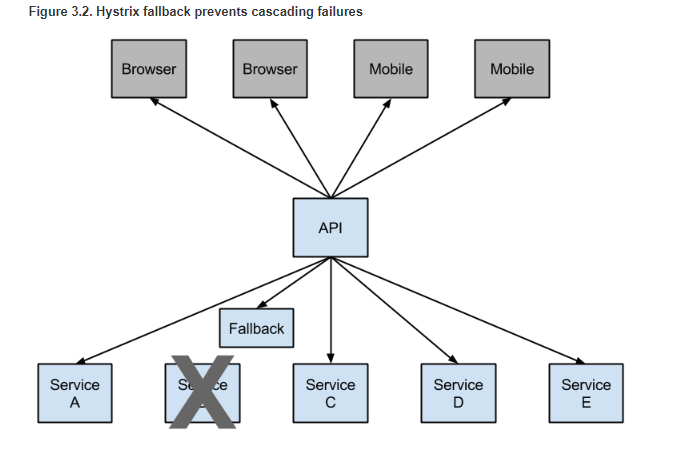

## Spring Cloud 组件学习 知识小总结

微服务设计原则：

1. 单一职责

2. 轻量级通信 （通常基于 RESTful API，还有 AMQP etc.）

3. 独立性

4. 进程隔离


### （1）**Spring Cloud Eureka**

>  服务治理：服务注册与服务发现。维护 `服务注册中心`、`生产者`、`消费者` 的关系

**1.1 Server、Client**

Eurake 包含两个组件 Eureka Server、Eureka Client

Eureka Server 维护一个注册中心，并每 30s 向各个服务发送一个心跳用于更新 “租赁”，若 Client 不能续约，则 Eureka Server 在 90s 内将会移除此服务。多个Server下，Eureka
 Server 还会在 5min 的间隔从对等的节点（由eureka.client.service-url.defaultZone 配置）中复制所有服务注册信息以达到同步的目的。

Eureka Client 在启动时会将自己的网络地址等信息注册（`Register`）到 Server， 也可以从 Server 获取所有的服务列表（也就是客户端缓存，降低 Server 的压力）。每 30s Client 会更新注册(`Renew`)信息。当然， Client 也可以不注册到 Server ，如纯粹的服务消费者，不需要注册自己，只需要获得服务列表；也可以不获取服务列表，如纯粹的服务提供者，只需要注册自己，不需要获取服务列表。

在启动类上加注解即可表明是Server 还是 Client，使用 @EnableEurekaClient 注册自己为客户端，使用@EnableEurekaServer 表明为 服务端。

注：使用 @EnableDiscoveryClient 也可以注册为 服务端，不过若用 Eureka 服务治理则推荐用 @EnableEurekaServer ，其他的则用 @EnableDiscoveryClient 。

**1.2 REST API**（端点）

Eureka 提供了许多接口，可用于 注册服务、取消注册、发送心跳等。官方链接为：<https://github.com/Netflix/eureka/wiki/Eureka-REST-operations>

**1.3 自我保护**

Eureka 有自我保护的功能，当 15min 内地若有低于 85% 的服务未续约，则 服务端进入自我保护，即不再删除服务，以保护服务注册信息。

比如 网络中断，其实服务没有不续租，但 注册中心 会认为不可用而删除，自我保护就是防止此类情况发生。

另外，服务端在 5min 同步 集群节点服务信息失败也会导致进入自我保护模式。

**1.4 高可用**

Eureka 的实际生产环境应该是一个集群而不是单机，多个 Eureka Server 之间相互注册，自动同步注册信息。部署集群需要：（1）Eureka 之间相互通信、同步；（2）Eureka Client在所有Server 中注册，可显示注册到多个Server（通过eureka.client.service-url.defaultZone），也可以只注册到一个上，等Server 集群自己同步。

[查看 Eureka Demo](<https://github.com/cantfu/springclouddemo/blob/master/md/SpringCloud%E7%BB%84%E4%BB%B6%E4%B9%8BEureka.md>)


### **（2）Spring Cloud Ribbon**

> 负载均衡（Load Balancing， LB）；具体消费者对数据的调用，实现服务的 **`客户端负载均衡`**调用
>
> 官方链接：<http://cloud.spring.io/spring-cloud-netflix/single/spring-cloud-netflix.html#spring-cloud-ribbon>

通常对于某个服务（生产者）会部署多个实例，当服务请求调用时，需要`负载均衡`来将请求分摊到不同实例上，防止某单个实例压力大或者实例不可用。

负载均衡解决方案主要由三种：

1）集中式负载均衡

当消费者调用某个服务时，先向负载均衡器发送请求，负载均衡器用某种负载均衡算法做处理后再发给具体的目标服务。这里的负载均衡处理发生在专门的负载均衡系统中。

**2）客户端均衡负载**

均衡负载的功能被整合到服务消费者中，需要配和服务发现的功能。在服务消费者启动时，从服务注册中心获取服务列表信息，并定时同步，当消费者发起某个服务请求时，`内置`的负载均衡器就会以某个负载均衡策略选择服务实例（某个生产者），然后在`本地`缓存的服务列表中查询具体地址，发起服务请求。

3）主机独立负载均衡

同第二种类似，但只是将负载均衡和服务发现 从服务消费者中移出来，作为独立的进程。消费者是一个进程，服务发现和负载均衡又是一个进程。

>  而 Ribbon 是第二种的负载均衡实现，客户端负载均衡

Ribbon 通常和 Eureka 进行无缝整合（当然也可以不用），Ribbon 内置了多个负载均衡算法（轮询、随机 etc.），也可以自定义。

消费者客户端在访问请求列表时，默认从配置为文件中的 **ribbonServerList**获取，但和 Eureka 整合后，会被 **DiscoveryEnabledNIWSServerList** 所重写，就可以实现自动从注册中心获取列表（也就是用上了服务发现功能，不用自己写死 ribbonServerList 了）。

[查看 Ribbon 和 Eureka 整合 demo](https://github.com/cantfu/springclouddemo/blob/master/md/SpringCloud%E7%BB%84%E4%BB%B6%E4%B9%8BRibbon.md)


### **（3）Spring Cloud Feign**

>  声明式服务调用。使得 (2) 的使用更加简单，可以简化我们的编码。以前是 Ribbon 和 RetTemplate 配合，现在是 Feign。
>
> <https://cloud.spring.io/spring-cloud-openfeign/spring-cloud-openfeign.html>

Spring Cloud 使得 Feign 支持了 Spring MVC 注解，并整合了 Ribbon 和 Eureka。

**使用**起来非常简单，

1. 在启动类添加 @EnableFeignClients，开启 Feign 功能
2. 自定义一个接口，添上注解 @FeignClient(name="xxx")，这个接口则是对应着 xxx 这个服务，接口的每个方法对应着这个 xxx 服务的每个接口。由于支持Spring MVC 注解，则这些方法使用@RequestMapping 注解即可，Feign 会自动生成这个接口的代理实现类，在需要调用服务处（如Controller）注入即可。

这样，就可以直接调用方法去调用服务，而不是用 restTemplate 写字符串拼接 url 和参数去调用服务，后者在参数多的时候其效率可想而知。

Spring Cloud Netflix默认为feign（`BeanType`beanName :) 提供以下bean `ClassName`：

+ `Decoder`feignDecoder :( `ResponseEntityDecoder`包装一个`SpringDecoder`）
+ `Encoder` feignEncoder： `SpringEncoder`
+ `Logger` feignLogger： `Slf4jLogger`
+ `Contract` feignContract： `SpringMvcContract`
+ `Feign.Builder` feignBuilder： `HystrixFeign.Builder`
+ `Client`feignClient：如果启用了功能区，则为a `LoadBalancerFeignClient`，否则使用默认的假设客户端。

**自定义配置**

先建一个配置类，使用@Configuration、@Bean 注解（注意此配置类不能在 Spring 的@ComponentScan 上下文中），在 ProviderService 服务接口上使用@FeignClient(name="", configuration="")即可实现自定义配置。

**手动创建 Feign**

// TODO 自定义配置、手动创建 Feign

[查看 Feign demo](https://github.com/cantfu/springclouddemo/blob/master/md/SpringCloud%E7%BB%84%E4%BB%B6%E4%B9%8BFeign.md)


### **（4）Spring Cloud Hystrix**

> `断路器客户端` :防止对某一故障服务持续进行访问、或关闭次要服务为主要服务让路。
>
> <https://github.com/Netflix/Hystrix/>
>
> <https://cloud.spring.io/spring-cloud-static/spring-cloud-netflix/2.1.0.RELEASE/single/spring-cloud-netflix.html#_circuit_breaker_hystrix_clients>

Hystrix已经停止开发,但仍然维护，官方推荐替代项目Resilience4j。

Hystrix 在调用某个服务不成功时（如挂掉、网络超时，整个服务集群都不可用），若没有处理方式则服务调用一直不成功，这个影响将直接传递到用户。为了整服务的可用性，可以加入容错处理，可暂时返回备用的信息（如提示错误信息。总比一直调用不成功好）。

服务降级：

此容错处理发生在客户端（即消费者），在整个生产者集群都不可用时就会调用此容错处理（fallback）。



可以用 Ribbon+RestTemplate+Hystrix，也可以用 Feign+Hystrix 的方式，spring cloud 的 Feign 集成了 Hystrix，更加方便。

** 当网络延迟导致时间超过 Hystrix 超时时间会发生熔断，超过 Ribbon 的超时时间可以发生重试，若想要要先重试可以增大 Hystrix 的超时时间（必须比 Ribbon 的大），通过设置`hystrix.command.default.execution.isolation.thread.timeoutInMilliseconds`即可。

**压缩支持**

Spring Cloud Feign 支持对请求和响应进行GZIP压缩，以减少通信过程中的性能损耗。通过下面的参数即可开启请求与响应的压缩功能：

```yaml
feign:
  compression:
    request:
      enabled: true # 开启请求压缩
    response:
      enabled: true # 开启响应压缩
```

同时，我们也可以对请求的数据类型，以及触发压缩的大小下限进行设置：

```yaml
feign:
  compression:
    request:
      enabled: true # 开启请求压缩
      mime-types: text/html,application/xml,application/json # 设置压缩的数据类型
      min-request-size: 2048 # 设置触发压缩的大小下限
```

注：上面的数据类型、压缩大小下限均为默认值。

[查看服务断路器 Hystrix demo](https://github.com/cantfu/springclouddemo/blob/master/md/SpringCloud%E7%BB%84%E4%BB%B6%E4%B9%8BHystrix.md)

### **（5）Spring Cloud Config**

分布式配置中心组件Spring Cloud Config.

### **（6）Spring Cloud Zuul**

服务网关：

### **（7）Spring Cloud Bus**

消息总线：动态更新服务配置 Config 等。


